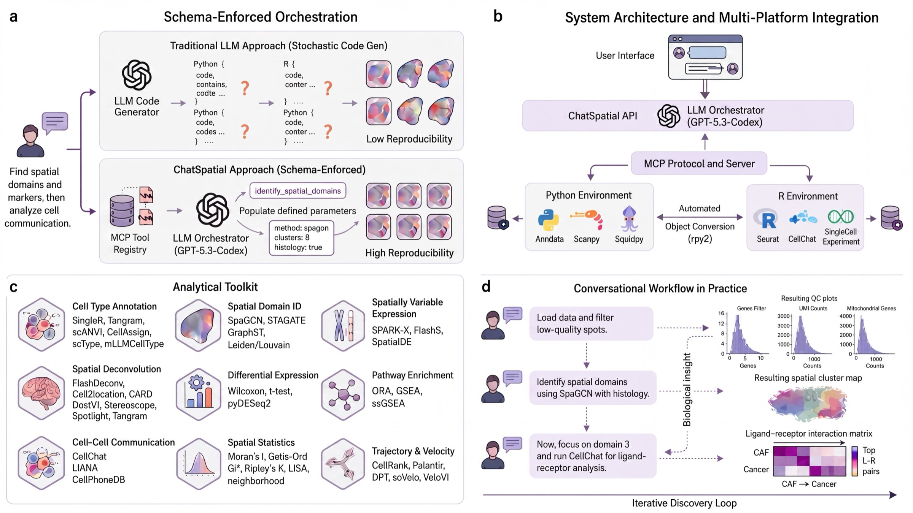

<div align="center">

# ChatSpatial

**MCP server for spatial transcriptomics analysis via natural language**

[](https://doi.org/10.64898/2026.02.26.708361)
[](https://openreview.net/forum?id=xZ814yNaUW)
[](https://www.enar.org/meetings/spring2026/)
[](https://www.ibc2026.org/home)
[](https://github.com/cafferychen777/ChatSpatial/actions/workflows/ci.yml)
[](https://pypi.org/project/chatspatial/)
[](https://www.python.org/downloads/)
[](https://opensource.org/licenses/MIT)
[](https://docs.cafferyang.com/)
[](https://github.com/users/cafferychen777/packages/container/package/chatspatial)

</div>

<p align="center">
  
</p>

ChatSpatial replaces ad-hoc LLM code generation with **schema-enforced orchestration**. Instead of generating arbitrary scripts, the LLM selects tools and parameters from a curated registry, making spatial transcriptomics workflows more reproducible across sessions and clients.

ChatSpatial exposes **20 schema-validated MCP tools** that orchestrate **65 spatial transcriptomics methods** across **15 analytical categories**. The tools are the stable natural-language interface; the methods are the analysis backends selected through tool parameters.

The server implements MCP `2026-07-28` through the official Python SDK v2 and
continues to serve `2025-11-25` clients through SDK-managed protocol negotiation.
STDIO remains the secure local default; Streamable HTTP is available for
explicitly configured HTTP deployments.

---

## Start Here

1. **Install ChatSpatial** — [Installation Guide](docs/installation.md) for Python/uv setup, or [Docker Guide](docs/docker.md) for the GHCR image
2. **Configure your MCP client** — [Configuration Guide](docs/advanced/configuration.md)
3. **Run your first analysis** — [Quick Start](docs/quickstart.md)

**Docker quick start:**

```bash
docker pull ghcr.io/cafferychen777/chatspatial:v1.3.0
```

**Minimal example prompt:**

```text
Load /absolute/path/to/spatial_data.h5ad and show me the tissue structure
```

If you use Docker, mount host data to `/data` and prompt with the container path, for example `/data/spatial_data.h5ad`.

> ChatSpatial works with **any MCP-compatible client** — Claude Code, Claude Desktop, Codex, OpenCode, and other MCP-capable tools.

---

## Capabilities

Current coverage includes 65 methods across 15 analytical categories, exposed through 20 MCP tools. Supports 10x Visium, Xenium, Slide-seq v2, MERFISH, seqFISH.

| Category | Example methods |
|----------|---------|
| **Data Loading & Preprocessing** | Scanpy I/O, QC, Normalization, HVG, PCA, Neighbors |
| **Visualization** | Spatial plots, Embedding plots, Gene expression overlays |
| **Spatial Domain Identification** | SpaGCN, STAGATE, GraphST, BANKSY, Leiden, Louvain |
| **Deconvolution** | FlashDeconv, Cell2location, RCTD, DestVI, Stereoscope, SPOTlight, Tangram, CARD |
| **Cell-Cell Communication** | LIANA+, CellPhoneDB, CellChat (`cellchat_r`), FastCCC |
| **Cell Type Annotation** | Tangram, scANVI, CellAssign, mLLMCelltype, scType, SingleR |
| **Differential Expression** | Wilcoxon, t-test, Logistic Regression, pyDESeq2 |
| **Trajectory Inference** | CellRank, Palantir, DPT |
| **RNA Velocity** | scVelo, VeloVI |
| **Spatial Statistics** | Moran's I, Local Moran, Geary's C, Getis-Ord Gi*, Ripley's K, Co-occurrence, Neighborhood Enrichment, Centrality Scores, Local Join Count, Network Properties |
| **Enrichment Analysis** | GSEA, ORA, Enrichr, ssGSEA, Spatial EnrichMap |
| **Spatially Variable Genes** | SpatialDE, SPARK-X, FlashS |
| **Multi-sample Integration** | Harmony, BBKNN, Scanorama, scVI |
| **CNV Analysis** | InferCNVPy, Numbat |
| **Spatial Registration** | PASTE, STalign |

---

## Documentation

| Guide | Use this when... |
|-------|------------------|
| [Installation](docs/installation.md) | You need to install ChatSpatial in a Python environment |
| [Docker](docs/docker.md) | You want a reproducible container runtime or local dependency resolution fails |
| [Configuration](docs/advanced/configuration.md) | You need exact MCP client syntax or the runtime path model |
| [Quick Start](docs/quickstart.md) | ChatSpatial is installed and you want the first successful analysis |
| [Concepts](docs/concepts.md) | You need to choose an analysis strategy from a biological question |
| [Examples](docs/examples.md) | You want copy-pasteable natural-language workflow prompts |
| [Methods Reference](docs/advanced/methods-reference.md) | You need canonical tool names, method names, parameters, and defaults |
| [Troubleshooting](docs/advanced/troubleshooting.md) | Setup, data loading, or analysis behavior is not working |
| [Full Docs](https://docs.cafferyang.com/) | You want the complete documentation site |

---

## Citation

If you use ChatSpatial in your research, please cite:

```bibtex
@article{Yang2026.02.26.708361,
  author = {Yang, Chen and Zhang, Xianyang and Chen, Jun},
  title = {ChatSpatial: Schema-Enforced Agentic Orchestration for Reproducible and Cross-Platform Spatial Transcriptomics},
  elocation-id = {2026.02.26.708361},
  year = {2026},
  doi = {10.64898/2026.02.26.708361},
  publisher = {Cold Spring Harbor Laboratory},
  URL = {https://www.biorxiv.org/content/early/2026/03/01/2026.02.26.708361},
  journal = {bioRxiv}
}
```

ChatSpatial orchestrates many excellent third-party methods. **Please also cite the original tools your analysis used.**

---

## Contributing

Documentation improvements, bug reports, and new analysis methods are all welcome. See [CONTRIBUTING.md](CONTRIBUTING.md).

<div align="center">

**MIT License** · [GitHub](https://github.com/cafferychen777/ChatSpatial) · [Issues](https://github.com/cafferychen777/ChatSpatial/issues)

</div>

<!-- mcp-name: io.github.cafferychen777/chatspatial -->
