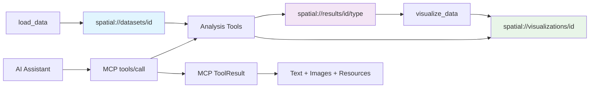

# ChatSpatial MCP Server Specification

## Overview

ChatSpatial is a **Model Context Protocol (MCP) server** for spatial transcriptomics analysis. It provides AI assistants with access to comprehensive spatial transcriptomics analysis capabilities through a standardized MCP interface.

**MCP Server Information:**
- **Name**: `ChatSpatial`
- **Version**: `0.3.x`
- **Protocol**: MCP v2024-11-05
- **Capabilities**: `tools`, `resources`, `prompts` (planned)

## MCP Architecture

### Server Capabilities

This server implements the MCP protocol to provide:

1. **Tools (32 implemented)**: Interactive analysis functions for spatial transcriptomics
2. **Resources (integrated)**: Access to datasets, analysis results, and visualizations  
3. **Prompts (planned)**: Workflow automation for common analysis patterns

### Transport Options

```json
{
  "mcpServers": {
    "chatspatial": {
      "command": "/path/to/python",
      "args": ["-m", "chatspatial.server"],
      "env": {
        "PYTHONPATH": "/path/to/chatspatial"
      }
    }
  }
}
```

## MCP Tools Specification

All tools follow MCP `tools/call` request format and return standardized `ToolResult` responses.

### 1. Data Management Tools

#### `load_data`
**Description**: Loads spatial transcriptomics data files and creates an MCP resource.

**MCP Tool Schema**:
```json
{
  "name": "load_data",
  "title": "Load Spatial Data",
  "description": "Load spatial transcriptomics data and register as MCP resource",
  "inputSchema": {
    "type": "object",
    "properties": {
      "data_path": {
        "type": "string",
        "description": "Absolute path to data file or directory"
      },
      "data_type": {
        "type": "string", 
        "enum": ["auto", "10x_visium", "slide_seq", "merfish", "seqfish", "h5ad"],
        "default": "auto",
        "description": "Data format type. 'auto' attempts to infer format."
      },
      "name": {
        "type": "string",
        "description": "Optional dataset name. Auto-generated if not provided."
      }
    },
    "required": ["data_path"]
  }
}
```

**MCP Tool Response**:
```json
{
  "content": [
    {
      "type": "text",
      "text": "Successfully loaded dataset 'mouse_brain_visium' with 15000 cells and 20000 genes."
    },
    {
      "type": "resource",
      "resource": {
        "uri": "spatial://datasets/mouse_brain_visium",
        "name": "mouse_brain_visium", 
        "mimeType": "application/x-anndata"
      }
    }
  ]
}
```

#### `preprocess_data` 
**Description**: Preprocess spatial transcriptomics data with quality control and normalization.

**MCP Tool Schema**:
```json
{
  "name": "preprocess_data",
  "title": "Preprocess Spatial Data",
  "description": "Preprocess spatial data with QC, normalization, and dimensionality reduction",
  "inputSchema": {
    "type": "object", 
    "properties": {
      "data_id": {
        "type": "string",
        "description": "Dataset identifier from load_data"
      },
      "min_genes": {
        "type": "integer", 
        "default": 200,
        "description": "Minimum genes per cell"
      },
      "max_genes": {
        "type": "integer", 
        "default": 5000,
        "description": "Maximum genes per cell"
      },
      "min_cells": {
        "type": "integer", 
        "default": 3,
        "description": "Minimum cells per gene"
      },
      "mt_threshold": {
        "type": "number", 
        "default": 20.0,
        "description": "Mitochondrial gene percentage threshold"
      },
      "normalization": {
        "type": "string",
        "enum": ["log", "sct", "scvi"],
        "default": "log",
        "description": "Normalization method"
      },
      "n_pcs": {
        "type": "integer", 
        "default": 50,
        "description": "Number of principal components"
      },
      "clustering_resolution": {
        "type": "number", 
        "default": 0.5,
        "description": "Leiden clustering resolution"
      }
    },
    "required": ["data_id"]
  }
}
```

**MCP Tool Response**:
```json
{
  "content": [
    {
      "type": "text", 
      "text": "Preprocessing completed. Filtered to 12500 cells and 18000 genes. Identified 2000 highly variable genes."
    }
  ]
}
```

### 2. Visualization Tools

#### `visualize_data`
**Description**: Generate spatial transcriptomics visualizations as MCP image content.

**MCP Tool Schema**:
```json
{
  "name": "visualize_data",
  "title": "Create Visualization",
  "description": "Create spatial transcriptomics visualizations",
  "inputSchema": {
    "type": "object",
    "properties": {
      "data_id": {
        "type": "string",
        "description": "Dataset identifier"
      },
      "plot_type": {
        "type": "string",
        "enum": [
          "spatial", "umap", "violin", "heatmap", "dotplot",
          "spatial_domains", "cell_communication", "deconvolution", 
          "trajectory", "gaston_isodepth", "gaston_domains"
        ],
        "default": "spatial",
        "description": "Type of visualization to generate"
      },
      "feature": {
        "type": "string", 
        "description": "Gene or feature to visualize"
      },
      "colormap": {
        "type": "string", 
        "default": "viridis",
        "description": "Color scheme for visualization"
      },
      "figure_size": {
        "type": "array",
        "items": {"type": "integer"},
        "minItems": 2,
        "maxItems": 2,
        "description": "Figure size as [width, height] in inches"
      },
      "alpha": {
        "type": "number",
        "default": 0.8,
        "description": "Point transparency"
      },
      "show_legend": {
        "type": "boolean",
        "default": true,
        "description": "Whether to show legend"
      }
    },
    "required": ["data_id"]
  }
}
```

**MCP Tool Response**:
```json
{
  "content": [
    {
      "type": "image",
      "data": "<base64_encoded_png_data>",
      "mimeType": "image/png"
    },
    {
      "type": "resource",
      "resource": {
        "uri": "spatial://visualizations/mouse_brain_spatial_1673892000", 
        "name": "Spatial plot - Foxp2",
        "mimeType": "image/png",
        "description": "Spatial expression visualization of gene Foxp2"
      }
    }
  ]
}
```

### 3. Analysis Tools

#### `annotate_cells`
**Description**: Perform automated cell type annotation using multiple methods.

**MCP Tool Schema**:
```json
{
  "name": "annotate_cells",
  "title": "Annotate Cell Types",
  "description": "Annotate cell types in spatial transcriptomics data", 
  "inputSchema": {
    "type": "object",
    "properties": {
      "data_id": {
        "type": "string",
        "description": "Dataset identifier"
      },
      "method": {
        "type": "string",
        "enum": [
          "marker_genes", "correlation", "tangram", "scanvi", 
          "cellassign", "mllmcelltype", "supervised"
        ],
        "default": "marker_genes",
        "description": "Cell type annotation method"
      },
      "reference_data_id": {
        "type": "string",
        "description": "Reference single-cell dataset (required for tangram, scanvi)"
      },
      "marker_genes": {
        "type": "object",
        "description": "Cell type marker genes dictionary"
      },
      "confidence_threshold": {
        "type": "number",
        "default": 0.5,
        "description": "Minimum confidence for cell type assignment"
      }
    },
    "required": ["data_id"]
  }
}
```

**MCP Tool Response**:
```json
{
  "content": [
    {
      "type": "text",
      "text": "Cell type annotation completed using 'marker_genes' method. Identified 8 cell types with average confidence 0.82."
    },
    {
      "type": "resource",
      "resource": {
        "uri": "spatial://results/mouse_brain_visium/annotation_marker_genes",
        "name": "Cell Type Annotations (marker_genes)",
        "mimeType": "application/json",
        "description": "Cell type assignments and confidence scores for each cell"
      }
    }
  ]
}
```

#### `find_spatial_genes`
**Description**: Identify spatially variable genes using deep learning and statistical methods.

**MCP Tool Schema**:
```json
{
  "name": "find_spatial_genes",
  "title": "Find Spatial Variable Genes",
  "description": "Identify spatially variable genes using GASTON, SpatialDE, or SPARK",
  "inputSchema": {
    "type": "object",
    "properties": {
      "data_id": {
        "type": "string",
        "description": "Dataset identifier"
      },
      "method": {
        "type": "string",
        "enum": ["gaston", "spatialde", "spark"],
        "default": "gaston",
        "description": "Spatial gene detection method"
      },
      "n_genes": {
        "type": "integer", 
        "description": "Maximum number of genes to analyze"
      },
      "preprocessing_method": {
        "type": "string",
        "enum": ["glmpca", "pearson_residuals"],
        "default": "pearson_residuals",
        "description": "Preprocessing method for GASTON"
      },
      "epochs": {
        "type": "integer",
        "default": 100,
        "description": "Number of training epochs for GASTON"
      },
      "n_domains": {
        "type": "integer",
        "default": 5,
        "description": "Number of spatial domains for GASTON"
      }
    },
    "required": ["data_id"]
  }
}
```

**MCP Tool Response**:
```json
{
  "content": [
    {
      "type": "text",
      "text": "Found 150 spatially variable genes using the 'gaston' method. Analysis completed in 45 seconds."
    },
    {
      "type": "resource",
      "resource": {
        "uri": "spatial://results/mouse_brain_visium/spatial_genes_gaston",
        "name": "Spatial Variable Genes (GASTON)",
        "mimeType": "application/json",
        "description": "List of spatially variable genes with statistics and p-values"
      }
    }
  ]
}
```

#### `analyze_cell_communication`
**Description**: Analyze cell-cell communication patterns using LIANA+ framework.

**MCP Tool Schema**:
```json
{
  "name": "analyze_cell_communication",
  "title": "Analyze Cell Communication",
  "description": "Analyze spatial cell-cell communication patterns using LIANA+",
  "inputSchema": {
    "type": "object",
    "properties": {
      "data_id": {
        "type": "string",
        "description": "Dataset identifier"
      },
      "method": {
        "type": "string", 
        "enum": ["liana"],
        "default": "liana",
        "description": "Cell communication analysis method"
      },
      "analysis_mode": {
        "type": "string",
        "enum": ["global", "cluster", "spatial_bivariate"],
        "default": "global",
        "description": "Analysis mode for spatial metrics"
      },
      "sender_cell_type": {
        "type": "string",
        "description": "Specific sender cell type (optional)"
      },
      "receiver_cell_type": {
        "type": "string",
        "description": "Specific receiver cell type (optional)"
      },
      "species": {
        "type": "string",
        "enum": ["human", "mouse", "zebrafish"],
        "default": "human",
        "description": "Species for ligand-receptor database"
      },
      "min_cells": {
        "type": "integer",
        "default": 3,
        "description": "Minimum cells expressing ligand/receptor"
      }
    },
    "required": ["data_id"]
  }
}
```

**MCP Tool Response**:
```json
{
  "content": [
    {
      "type": "text",
      "text": "Cell communication analysis completed using LIANA+. Identified 45 significant ligand-receptor pairs across 8 cell types."
    },
    {
      "type": "resource",
      "resource": {
        "uri": "spatial://results/mouse_brain_visium/communication_liana",
        "name": "Cell Communication Results (LIANA+)",
        "mimeType": "application/json",
        "description": "Ligand-receptor interaction results with spatial metrics"
      }
    }
  ]
}
```

### 4. Advanced Analysis Tools

#### `identify_spatial_domains`
**Description**: Identify spatial domains and tissue architecture using graph-based methods.

**MCP Tool Schema**:
```json
{
  "name": "identify_spatial_domains",
  "title": "Identify Spatial Domains",
  "description": "Identify spatial domains using SpaGCN, STAGATE, or BANKSY",
  "inputSchema": {
    "type": "object",
    "properties": {
      "data_id": {
        "type": "string",
        "description": "Dataset identifier"
      },
      "method": {
        "type": "string",
        "enum": ["spagcn", "leiden", "louvain", "stagate", "banksy"],
        "default": "spagcn",
        "description": "Spatial domain identification method"
      },
      "n_domains": {
        "type": "integer",
        "default": 7,
        "description": "Number of spatial domains to identify"
      },
      "use_histology": {
        "type": "boolean",
        "default": true,
        "description": "Use histology image information (SpaGCN)"
      },
      "resolution": {
        "type": "number",
        "default": 0.5,
        "description": "Clustering resolution parameter"
      }
    },
    "required": ["data_id"]
  }
}
```

**MCP Tool Response**:
```json
{
  "content": [
    {
      "type": "text",
      "text": "Spatial domain identification completed using 'spagcn' method. Identified 7 distinct spatial domains with modularity 0.85."
    },
    {
      "type": "resource",
      "resource": {
        "uri": "spatial://results/mouse_brain_visium/domains_spagcn",
        "name": "Spatial Domains (SpaGCN)",
        "mimeType": "application/json",
        "description": "Spatial domain assignments and clustering metrics"
      }
    }
  ]
}
```

#### `deconvolve_data` 
**Description**: Deconvolve spatial spots to estimate cell type compositions using scvi-tools methods.

**MCP Tool Schema**:
```json
{
  "name": "deconvolve_data",
  "title": "Deconvolve Spatial Data",
  "description": "Estimate cell type compositions using Cell2location, RCTD, or DestVI",
  "inputSchema": {
    "type": "object",
    "properties": {
      "data_id": {
        "type": "string",
        "description": "Dataset identifier"
      },
      "method": {
        "type": "string",
        "enum": ["cell2location", "rctd", "destvi", "stereoscope", "spotlight"],
        "default": "cell2location",
        "description": "Deconvolution method"
      },
      "reference_data_id": {
        "type": "string",
        "description": "Reference single-cell dataset identifier"
      },
      "cell_type_key": {
        "type": "string",
        "default": "cell_type",
        "description": "Cell type annotation key in reference data"
      },
      "n_epochs": {
        "type": "integer",
        "default": 10000,
        "description": "Number of training epochs"
      },
      "use_gpu": {
        "type": "boolean",
        "default": false,
        "description": "Use GPU acceleration"
      }
    },
    "required": ["data_id", "reference_data_id"]
  }
}
```

**MCP Tool Response**:
```json
{
  "content": [
    {
      "type": "text",
      "text": "Spatial deconvolution completed using 'cell2location' method. Estimated cell type abundances for 12 cell types across 2500 spatial locations."
    },
    {
      "type": "resource",
      "resource": {
        "uri": "spatial://results/mouse_brain_visium/deconvolution_cell2location",
        "name": "Deconvolution Results (Cell2location)",
        "mimeType": "application/json",
        "description": "Cell type abundance estimates and deconvolution metrics"
      }
    }
  ]
}
```

#### `integrate_samples`
**Description**: Integrate multiple spatial transcriptomics samples using Harmony, scVI, or other methods.

**MCP Tool Schema**:
```json
{
  "name": "integrate_samples",
  "title": "Integrate Multiple Samples",
  "description": "Integrate spatial transcriptomics samples using Harmony, scVI, or BBKNN",
  "inputSchema": {
    "type": "object",
    "properties": {
      "data_ids": {
        "type": "array",
        "items": {"type": "string"},
        "description": "List of dataset identifiers to integrate"
      },
      "method": {
        "type": "string",
        "enum": ["harmony", "bbknn", "scanorama", "mnn", "scvi"],
        "default": "harmony",
        "description": "Integration method"
      },
      "batch_key": {
        "type": "string",
        "default": "batch",
        "description": "Batch information key"
      },
      "n_pcs": {
        "type": "integer",
        "default": 30,
        "description": "Number of principal components"
      },
      "align_spatial": {
        "type": "boolean",
        "default": true,
        "description": "Align spatial coordinates"
      }
    },
    "required": ["data_ids"]
  }
}
```

**MCP Tool Response**:
```json
{
  "content": [
    {
      "type": "text",
      "text": "Sample integration completed using 'harmony' method. Successfully integrated 3 samples with 8500 total spots."
    },
    {
      "type": "resource",
      "resource": {
        "uri": "spatial://results/integrated_samples/integration_harmony",
        "name": "Sample Integration Results (Harmony)",
        "mimeType": "application/json",
        "description": "Integrated embeddings and batch correction metrics"
      }
    }
  ]
}
```

#### `analyze_trajectory_data`
**Description**: Infer cellular trajectories and pseudotime using Palantir, CellRank, or DPT.

**MCP Tool Schema**:
```json
{
  "name": "analyze_trajectory_data",
  "title": "Analyze Cell Trajectories",
  "description": "Infer pseudotime trajectories using Palantir, CellRank, or DPT",
  "inputSchema": {
    "type": "object",
    "properties": {
      "data_id": {
        "type": "string",
        "description": "Dataset identifier"
      },
      "method": {
        "type": "string",
        "enum": ["cellrank", "palantir", "dpt", "velovi"],
        "default": "cellrank",
        "description": "Trajectory inference method"
      },
      "root_cells": {
        "type": "array",
        "items": {"type": "string"},
        "description": "Root cell identifiers for trajectory start"
      },
      "spatial_weight": {
        "type": "number",
        "default": 0.5,
        "description": "Weight for spatial information in trajectory"
      },
      "n_states": {
        "type": "integer",
        "default": 5,
        "description": "Number of macrostates (CellRank)"
      }
    },
    "required": ["data_id"]
  }
}
```

**MCP Tool Response**:
```json
{
  "content": [
    {
      "type": "text",
      "text": "Trajectory analysis completed using 'cellrank' method. Identified 5 macrostates and computed pseudotime for 12500 cells."
    },
    {
      "type": "resource",
      "resource": {
        "uri": "spatial://results/mouse_brain_visium/trajectory_cellrank",
        "name": "Trajectory Analysis Results (CellRank)",
        "mimeType": "application/json",
        "description": "Pseudotime values, macrostates, and trajectory metrics"
      }
    }
  ]
}
```

#### `analyze_enrichment`
**Description**: Perform pathway enrichment analysis using GSEA, ORA, or Enrichr.

**MCP Tool Schema**:
```json
{
  "name": "analyze_enrichment",
  "title": "Analyze Pathway Enrichment",
  "description": "Perform gene set enrichment analysis with spatial smoothing",
  "inputSchema": {
    "type": "object",
    "properties": {
      "data_id": {
        "type": "string",
        "description": "Dataset identifier"
      },
      "gene_sets": {
        "type": "object",
        "description": "Gene sets dictionary for enrichment analysis"
      },
      "method": {
        "type": "string",
        "enum": ["gsea", "ssgsea", "ora", "enrichmap"],
        "default": "gsea",
        "description": "Enrichment analysis method"
      },
      "spatial_smoothing": {
        "type": "boolean",
        "default": true,
        "description": "Apply spatial smoothing to enrichment scores"
      },
      "k_neighbors": {
        "type": "integer",
        "default": 15,
        "description": "Number of neighbors for spatial smoothing"
      },
      "gene_weights": {
        "type": "string",
        "enum": ["uniform", "logfc", "custom"],
        "default": "uniform",
        "description": "Gene weighting strategy"
      }
    },
    "required": ["data_id", "gene_sets"]
  }
}
```

**MCP Tool Response**:
```json
{
  "content": [
    {
      "type": "text",
      "text": "Pathway enrichment analysis completed using 'gsea' method with spatial smoothing. Analyzed 25 gene sets across spatial locations."
    },
    {
      "type": "resource",
      "resource": {
        "uri": "spatial://results/mouse_brain_visium/enrichment_gsea",
        "name": "Pathway Enrichment Results (GSEA)",
        "mimeType": "application/json",
        "description": "Enrichment scores, p-values, and spatial smoothing results"
      }
    }
  ]
}
```

## MCP Resources Integration

ChatSpatial creates and manages the following MCP resource types with automatic chaining:



### MCP Resource URI Patterns

| Resource Type | URI Pattern | MIME Type | Description |
|---------------|-------------|-----------|-------------|
| **Dataset** | `spatial://datasets/{data_id}` | `application/x-anndata` | Dataset metadata, cell/gene counts, preprocessing status |
| **Analysis Results** | `spatial://results/{data_id}/{analysis_type}` | `application/json` | Structured analysis outputs (domains, genes, communication) |
| **Visualizations** | `spatial://visualizations/{viz_id}` | `image/png` | Generated plot images with metadata |
| **Spatial Genes** | `spatial://results/{data_id}/spatial_genes_{method}` | `application/json` | GASTON, SpatialDE, or SPARK results with statistics |
| **Cell Types** | `spatial://results/{data_id}/annotation_{method}` | `application/json` | Cell type assignments and confidence scores |
| **Communication** | `spatial://results/{data_id}/communication_{method}` | `application/json` | Ligand-receptor interactions and spatial metrics |
| **Domains** | `spatial://results/{data_id}/domains_{method}` | `application/json` | Spatial domain clustering and assignments |

## Error Handling

All tools implement standardized MCP error handling:

```json
{
  "isError": true,
  "content": [
    {
      "type": "text",
      "text": "Error: Dataset 'invalid_id' not found. Available datasets: ['mouse_brain', 'human_liver']"
    }
  ]
}
```

**Error Categories**:

- `DataNotFoundError` (-32001): Dataset or result not found
- `InvalidParameterError` (-32602): Invalid parameter values or schema validation failures
- `ProcessingError` (-32003): Analysis execution failures or computation errors
- `DependencyError` (-32004): Missing required packages or environment setup
- `VisualizationError` (-32004): Plot generation or image encoding failures
- `InternalError` (-32603): Unexpected server errors with full traceback

## Usage Examples

### Basic Spatial Analysis Workflow

1. **Load Data**:

```json
{
  "method": "tools/call",
  "params": {
    "name": "load_data", 
    "arguments": {
      "data_path": "/path/to/visium_data",
      "data_type": "10x_visium"
    }
  }
}
```

2. **Preprocess** (flattened schema):

```json
{
  "method": "tools/call",
  "params": {
    "name": "preprocess_data",
    "arguments": {
      "data_id": "visium_mouse_brain",
      "min_genes": 200,
      "normalization": "log",
      "clustering_resolution": 0.5
    }
  }
}
```

3. **Visualize** (flattened schema):

```json
{
  "method": "tools/call", 
  "params": {
    "name": "visualize_data",
    "arguments": {
      "data_id": "visium_mouse_brain",
      "plot_type": "spatial",
      "feature": "Foxp2",
      "colormap": "viridis",
      "show_legend": true
    }
  }
}
```

## Integration with AI Assistants

ChatSpatial's MCP interface enables natural language interaction with automatic resource chaining:

**User**: "Load the Visium mouse brain data and show me the spatial expression of Foxp2"

**AI Assistant** → MCP calls (flattened parameters):

1. `load_data(data_path="/data/mouse_brain", data_type="10x_visium")`  
   → Creates: `spatial://datasets/mouse_brain_visium`
2. `visualize_data(data_id="mouse_brain_visium", plot_type="spatial", feature="Foxp2")`  
   → Creates: `spatial://visualizations/mouse_brain_spatial_1673892000`

**Advanced Workflow Example**:

```text
User: "Find spatial genes using GASTON and visualize the results"
↓
1. find_spatial_genes(data_id="dataset", method="gaston")
   → spatial://results/dataset/spatial_genes_gaston
2. visualize_data(data_id="dataset", plot_type="gaston_isodepth")
   → spatial://visualizations/gaston_isodepth_12345
```

The MCP protocol ensures seamless integration with Claude Desktop, Continue, and other MCP-compatible AI tools through standardized resource URIs and flattened parameter schemas.

## Performance Considerations

- **Timeout Handling**: All tools respect MCP timeout limits (typically 4 minutes for Claude Desktop)
- **Large Dataset Support**: Automatic chunking and progress reporting for large analyses
- **Resource Caching**: Efficient caching of visualizations and analysis results
- **Memory Management**: Smart memory usage for large spatial datasets

## Dependencies

**Core Requirements**:

- Python 3.10+
- scanpy, anndata, pandas, numpy
- matplotlib, seaborn
- mcp (Model Context Protocol SDK)

**Optional Analysis Methods**:

- scvi-tools (for advanced deep learning methods)
- liana (for cell communication analysis)
- gaston-spatial (for GASTON spatial gene detection)
- R + rpy2 (for SPARK analysis)

## Contributing

ChatSpatial follows MCP best practices for extensibility. New analysis methods can be added by:

1. Implementing the analysis function in `chatspatial/tools/`
2. Adding MCP tool decorator with proper schema
3. Registering in the server module
4. Adding documentation following this specification format

---

This specification covers ChatSpatial v0.3.x implementing MCP protocol version 2024-11-05.
