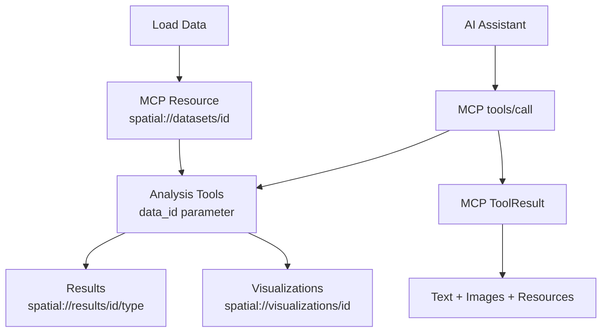

# ChatSpatial MCP Tools Quick Reference

## Overview

ChatSpatial provides **32 MCP tools** for spatial transcriptomics analysis. All tools follow standard MCP `tools/call` protocol.

## Data Flow Architecture



## Tool Categories

### 🔄 Data Management
- `load_data` → Returns `SpatialDataset` + creates resource `spatial://datasets/{id}`
- `preprocess_data` → Returns `PreprocessingResult`

### 📊 Visualization  
- `visualize_data` → Returns `Image` + creates resource `spatial://visualizations/{id}`

### 🔬 Cell Analysis
- `annotate_cells` → Returns `AnnotationResult` (cell types)
- `find_markers` → Returns `DifferentialExpressionResult` (DE genes)

### 🧬 Spatial Analysis
- `find_spatial_genes` → Returns `SpatialVariableGenesResult` (GASTON/SpatialDE/SPARK)
- `identify_spatial_domains` → Returns `SpatialDomainResult` (SpaGCN/STAGATE/BANKSY)
- `analyze_spatial_data` → Returns `SpatialAnalysisResult` (Moran's I, etc.)

### 💬 Cell Communication
- `analyze_cell_communication` → Returns `CellCommunicationResult` (LIANA+)

### 🔗 Integration & Trajectory
- `integrate_samples` → Returns `IntegrationResult` (Harmony/scVI)
- `analyze_trajectory_data` → Returns `TrajectoryResult` (Palantir/CellRank)
- `analyze_velocity_data` → Returns `RNAVelocityResult`

### 🧮 Deconvolution & Enrichment
- `deconvolve_data` → Returns `DeconvolutionResult` (Cell2location/RCTD)
- `analyze_enrichment` → Returns `EnrichmentResult` (GSEA/ORA)

### 📏 Spatial Statistics
- `calculate_spatial_statistics` → Returns spatial stats (Moran's I, Geary's C)
- `register_spatial_data` → Returns alignment results

## Standard MCP Tool Pattern

All ChatSpatial tools follow this pattern:

```python
@mcp.tool()
@mcp_tool_error_handler()
async def tool_name(
    data_id: str,                    # Dataset identifier (required)
    params: ParameterModel = None,   # Tool-specific parameters 
    context: Context = None          # MCP context
) -> ResultModel:                    # Typed return value
```

## Core Parameter Models

### Universal Parameters
- `data_id: str` - Dataset identifier from `load_data`
- `context: Context` - MCP context (auto-injected)

### Common Parameter Types
- `AnalysisParameters` - Basic analysis settings
- `VisualizationParameters` - Plot configuration  
- `AnnotationParameters` - Cell type annotation settings
- `SpatialAnalysisParameters` - Spatial statistics configuration

## Resource URI Patterns

ChatSpatial creates MCP resources with these URI patterns:

| Resource Type | URI Pattern | MIME Type |
|---------------|-------------|-----------|
| Dataset | `spatial://datasets/{data_id}` | `application/x-anndata` |
| Analysis Result | `spatial://results/{data_id}/{type}` | `application/json` |
| Visualization | `spatial://visualizations/{viz_id}` | `image/png` |

## MCP Tool Response Format

### Text Response
```json
{
  "content": [
    {"type": "text", "text": "Analysis completed successfully"}
  ]
}
```

### Image Response  
```json
{
  "content": [
    {
      "type": "image", 
      "data": "<base64_png>",
      "mimeType": "image/png"
    }
  ]
}
```

### Resource Response
```json
{
  "content": [
    {
      "type": "resource",
      "resource": {
        "uri": "spatial://datasets/mouse_brain",
        "name": "Mouse Brain Visium",
        "mimeType": "application/x-anndata"
      }
    }
  ]
}
```

## Error Handling

Standardized MCP error responses:

```json
{
  "isError": true,
  "content": [
    {
      "type": "text",
      "text": "Error: Dataset 'invalid_id' not found"
    }
  ]
}
```

## Quick Start Example

```bash
# 1. Load data
{
  "method": "tools/call",
  "params": {
    "name": "load_data",
    "arguments": {
      "data_path": "/path/to/visium", 
      "data_type": "10x_visium"
    }
  }
}

# 2. Preprocess  
{
  "method": "tools/call",
  "params": {
    "name": "preprocess_data",
    "arguments": {
      "data_id": "visium_dataset_001"
    }
  }
}

# 3. Find spatial genes
{
  "method": "tools/call", 
  "params": {
    "name": "find_spatial_genes",
    "arguments": {
      "data_id": "visium_dataset_001",
      "params": {"method": "gaston"}
    }
  }
}

# 4. Visualize results
{
  "method": "tools/call",
  "params": {
    "name": "visualize_data",
    "arguments": {
      "data_id": "visium_dataset_001",
      "params": {
        "plot_type": "spatial",
        "feature": "Foxp2"
      }
    }
  }
}
```

## Method Availability Status

### ✅ Production Ready
- **GASTON**: Deep learning spatial genes (with fallback handling)
- **SpatialDE**: Statistical spatial genes (scipy 1.13.1 compatible) 
- **SPARK**: R-based spatial genes (with proper data format)
- **LIANA+**: Cell communication analysis
- **SpaGCN/STAGATE**: Spatial domains

### 🟡 Experimental
- **scVI-tools methods**: Require additional dependencies
- **R-based methods**: Require R environment setup

### 📋 Full Tool List

1. `load_data` - Load spatial data
2. `preprocess_data` - QC and normalization  
3. `visualize_data` - Generate plots
4. `annotate_cells` - Cell type annotation
5. `analyze_spatial_data` - Spatial statistics
6. `find_markers` - Differential expression
7. `analyze_velocity_data` - RNA velocity
8. `analyze_trajectory_data` - Pseudotime inference  
9. `integrate_samples` - Multi-sample integration
10. `deconvolve_data` - Cell type deconvolution
11. `identify_spatial_domains` - Spatial clustering
12. `analyze_cell_communication` - Cell-cell communication
13. `analyze_enrichment` - Pathway analysis
14. `find_spatial_genes` - Spatial variable genes
15. `register_spatial_data` - Spatial alignment
16. `calculate_spatial_statistics` - Spatial metrics
17. ... *(32 total tools)*

---

*For detailed schemas and parameters, see the full MCP Server Specification.*