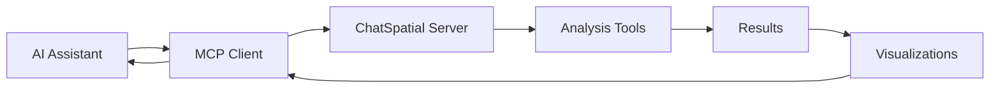

# ChatSpatial: AI-Powered Spatial Transcriptomics Analysis


**Interactive Spatial Transcriptomics Analysis via Model Context Protocol**

[](https://python.org)
[](https://modelcontextprotocol.io)
[](https://github.com/cafferychen777/ChatSpatial/blob/main/LICENSE)
[](https://github.com/cafferychen777/ChatSpatial)

## 🤖 What is Model Context Protocol (MCP)?

**Model Context Protocol (MCP)** is an open standard that enables AI assistants to securely connect with external tools and data sources. Think of it as a universal "plugin system" for AI that allows natural language interaction with specialized software.

**� [Learn more about MCP →](what_is_mcp.md)**

### 🎥 New to MCP? Watch This!

[](https://www.youtube.com/watch?v=sfCBCyNyw7U)

*Simple 5-minute explanation of what MCP is and why it matters*
### Why MCP + ChatSpatial?

Instead of learning complex bioinformatics tools, simply ask:

> *"Load my Visium data and identify spatial domains"*
> *"Which genes show spatial patterns in my dataset?"*
> *"Visualize cell communication networks"*

ChatSpatial handles the technical complexity while you focus on biological insights.

## 🎯 What is ChatSpatial?

ChatSpatial is a production-ready **MCP server** that provides AI assistants with comprehensive spatial transcriptomics analysis capabilities. It enables natural language interaction with complex spatial data analysis through **16 standardized MCP tools**.

### Key Features

- **🔬 16+ Analysis Tools**: Complete spatial transcriptomics workflow from preprocessing to visualization
- **🤖 AI-Native**: Designed for seamless integration with Claude, GPT, and other AI assistants
- **📊 Multiple Technologies**: Support for Visium, MERFISH, Slide-seq, and other spatial platforms
- **🎨 Rich Visualizations**: 15+ plot types with MCP image objects for direct AI display
- **🔧 Production Ready**: Robust error handling, validation, and comprehensive testing

## 🚀 Quick Start

### 1. Installation
```bash
# Create environment
conda create -n chatspatial python=3.10
conda activate chatspatial

# Install ChatSpatial
pip install -e .
```

### 2. MCP Configuration
Add to your Claude Desktop configuration:
```json
{
  "mcpServers": {
    "chatspatial": {
      "command": "/path/to/your/python",
      "args": ["-m", "chatspatial"],
      "env": {}
    }
  }
}
```

### 3. First Analysis
```python
# Load spatial data
load_data(file_path="data.h5ad", data_id="my_data")

# Preprocess
preprocess_data(data_id="my_data")

# Identify spatial domains
identify_spatial_domains(data_id="my_data", method="spagcn")

# Visualize results
visualize_data(data_id="my_data", plot_type="spatial_domains")
```

## 📚 Documentation Structure

### 🏁 Getting Started
- **[Installation Guide](getting_started.md)** - Complete setup instructions
- **[Quick Tutorial](tutorials/basic_spatial_analysis.md)** - Your first spatial analysis

### 🔧 API Reference
- **[Tool Reference](api/README.md)** - Complete MCP tool documentation
- **[Data Models](api/data_models.md)** - Parameter and result schemas
- **[Error Handling](api/error_handling.md)** - Error codes and troubleshooting

### 📖 Tutorials
- **[Basic Workflow](tutorials/basic_spatial_analysis.md)** - Standard analysis pipeline
- **[Advanced Features](tutorials/advanced_analysis.md)** - Complex multi-modal analysis
- **[Visualization Gallery](tutorials/visualization_gallery.md)** - All plot types with examples

### 🎯 Use Cases
- **[Cell Type Annotation](tutorials/cell_annotation.md)** - Multiple annotation methods
- **[Spatial Domain Discovery](tutorials/spatial_domains.md)** - Tissue architecture analysis
- **[Cell Communication](tutorials/cell_communication.md)** - Intercellular signaling analysis

## 🛠️ Core Analysis Tools

| Category | Tools | Description |
|----------|-------|-------------|
| **Data Management** | `load_data`, `preprocess_data` | Data loading and preprocessing |
| **Cell Annotation** | `annotate_cells` | 7 annotation methods (Tangram, scType, etc.) |
| **Spatial Analysis** | `analyze_spatial_data`, `identify_spatial_domains` | Pattern analysis and domain identification |
| **Cell Communication** | `analyze_cell_communication` | LIANA+, CellPhoneDB, CellChat |
| **Deconvolution** | `deconvolve_data` | Cell2location, NNLS methods |
| **Gene Analysis** | `identify_spatial_genes`, `find_markers` | Spatial variable genes and markers |
| **Visualization** | `visualize_data` | 15+ plot types with AI-friendly outputs |

## 🏗️ MCP Architecture

ChatSpatial implements the Model Context Protocol for seamless AI integration:



### Why MCP?

- **Standardized Interface**: Consistent tool discovery and invocation
- **Type Safety**: JSON Schema validation for all inputs/outputs
- **Error Handling**: Structured error reporting and recovery
- **Streaming Support**: Real-time progress updates
- **Security**: Built-in access controls and validation

## 🔬 Supported Technologies

| Platform | Status | Features |
|----------|--------|----------|
| **10x Visium** | ✅ Full Support | Spatial domains, deconvolution, communication |
| **MERFISH** | ✅ Full Support | High-resolution analysis, trajectory inference |
| **Slide-seq** | ✅ Full Support | Subcellular resolution analysis |
| **STARmap** | ✅ Supported | 3D spatial analysis |
| **seqFISH+** | ✅ Supported | Single-cell resolution |
| **Xenium** | 🔄 In Progress | Next-generation spatial |

## 📊 Analysis Capabilities

### Preprocessing & QC
- Normalization (log, SCTransform, Pearson residuals)
- Quality control metrics
- Batch effect correction
- Spatial coordinate validation

### Cell Type Annotation
- **Marker-based**: Traditional marker gene approach
- **Tangram**: Spatial mapping with reference data
- **scType**: Automated cell type identification
- **Cell2location**: Probabilistic deconvolution
- **scANVI**: Semi-supervised annotation
- **CellAssign**: Probabilistic assignment
- **MLLMCellType**: Multi-modal LLM classifier

### Spatial Domain Identification
- **SpaGCN**: Graph convolutional networks
- **STAGATE**: Spatial-temporal attention
- **BANKSY**: Spatial clustering
- **Leiden/Louvain**: Community detection

### Cell Communication Analysis
- **LIANA+**: Comprehensive ligand-receptor analysis
- **CellPhoneDB**: Statistical interaction testing
- **CellChat**: Systematic communication analysis

## 🎨 Visualization Gallery

ChatSpatial provides rich visualizations optimized for AI assistants:

- **Spatial Plots**: Gene expression, domains, communication
- **UMAP/t-SNE**: Dimensionality reduction with annotations
- **Heatmaps**: Expression patterns and correlations
- **Violin Plots**: Distribution comparisons
- **Trajectory Plots**: Developmental pathways
- **Communication Networks**: Cell-cell interaction graphs

All visualizations are returned as MCP Image objects for direct display in AI interfaces.

## 🤝 Contributing

We welcome contributions! See our [Contributing Guide](../CONTRIBUTING.md) for details.

## 📄 License

ChatSpatial is released under the MIT License. See [LICENSE](../LICENSE) for details.

## 🆘 Support

- **Documentation**: Browse this site for comprehensive guides
- **Issues**: Report bugs on [GitHub Issues](https://github.com/cafferychen777/ChatSpatial/issues)
- **Discussions**: Join our [GitHub Discussions](https://github.com/cafferychen777/ChatSpatial/discussions)

