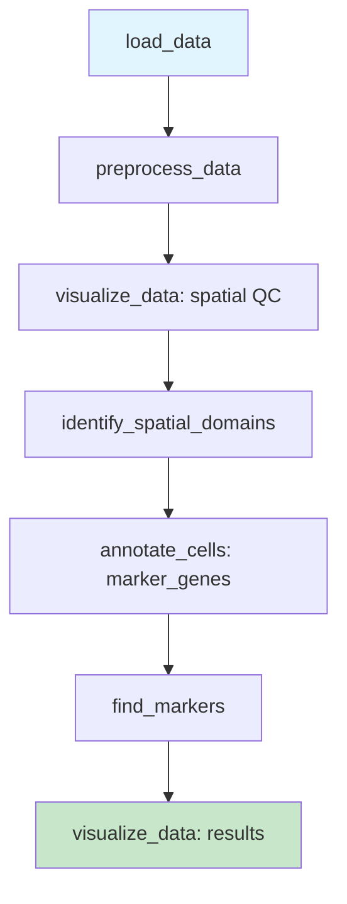
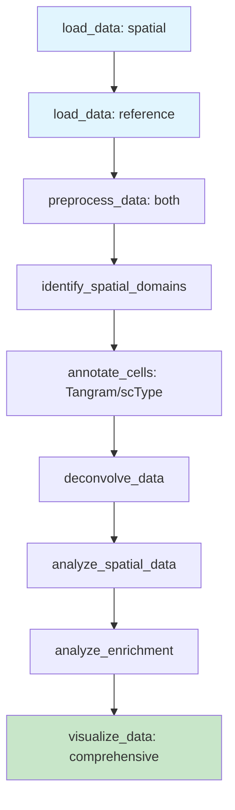
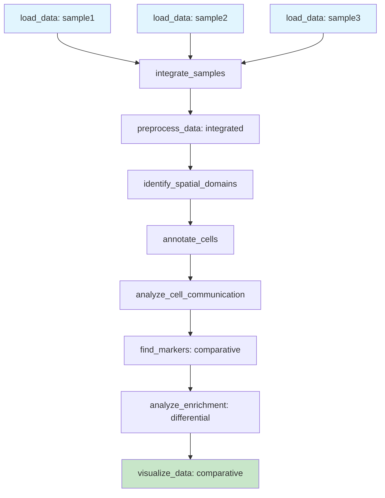
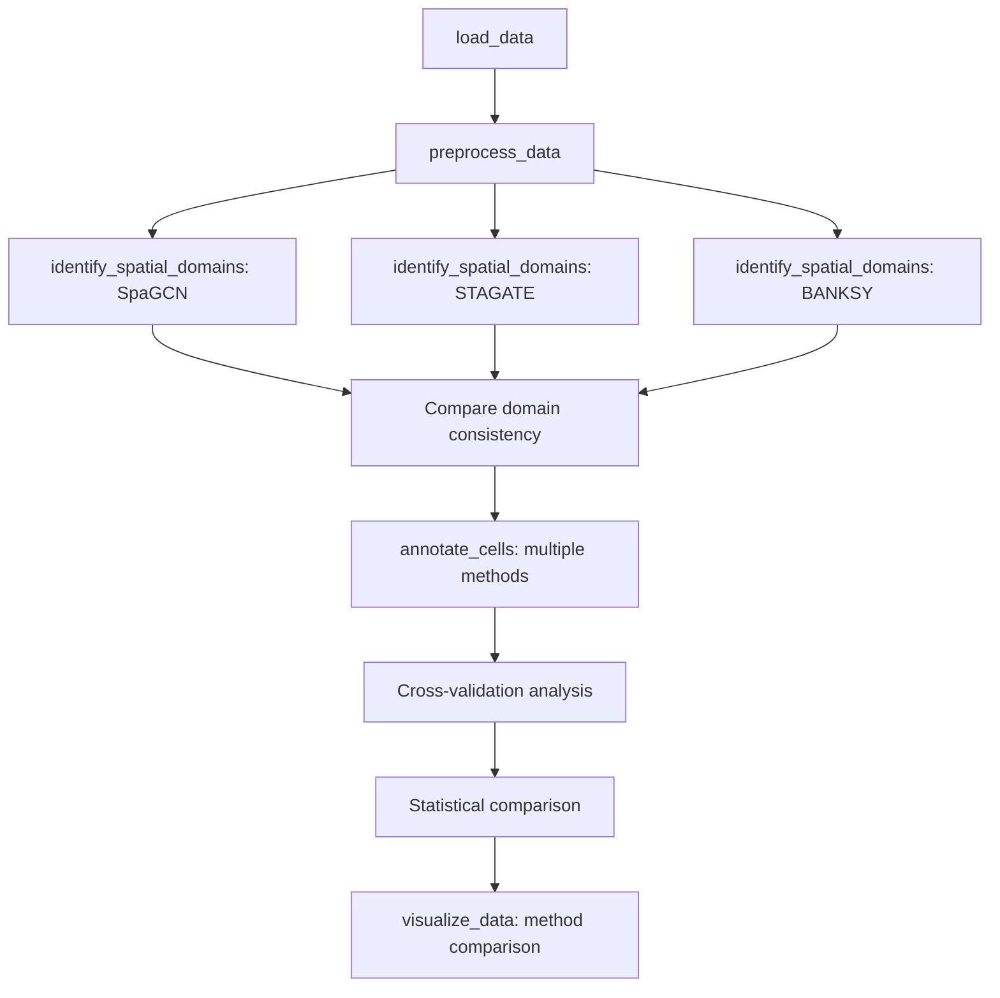
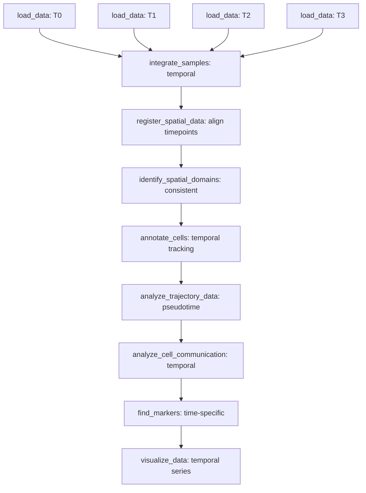
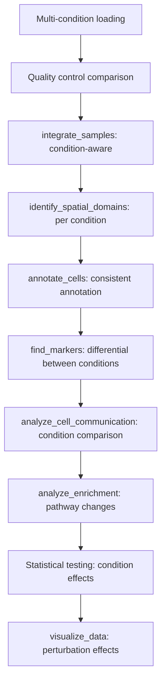

# 🔄 Common Workflows Quick Reference

> **Navigation**: Use this decision tree format to quickly find the right analysis path for your research question.

## 🎯 "If You Want To..." Quick Finder

### 📊 Data Loading & QC
| **Goal** | **Workflow** | **Difficulty** | **Time** |
|----------|-------------|----------------|----------|
| Load single Visium dataset | `load_data` → `preprocess_data` → `visualize_data` | 🟢 | 5 min |
| Load multiple samples | `load_data` (×N) → `integrate_samples` → `preprocess_data` | 🟡 | 15 min |
| Quality control check | `load_data` → `preprocess_data` (QC focus) → `visualize_data` | 🟢 | 10 min |

### 🗺️ Spatial Structure Analysis
| **Goal** | **Workflow** | **Difficulty** | **Time** |
|----------|-------------|----------------|----------|
| Find tissue regions | `load_data` → `preprocess_data` → `identify_spatial_domains` | 🟡 | 20 min |
| Compare domain methods | Run `identify_spatial_domains` with different methods | 🔴 | 45 min |
| Validate spatial patterns | Add `find_spatial_genes` → `analyze_spatial_data` | 🔴 | 30 min |

### 🧬 Cell Type Analysis  
| **Goal** | **Workflow** | **Difficulty** | **Time** |
|----------|-------------|----------------|----------|
| Basic cell typing | `preprocess_data` → `annotate_cells` (marker genes) | 🟢 | 15 min |
| Reference-based annotation | Add reference → `annotate_cells` (Tangram/scType) | 🟡 | 30 min |
| Validate cell types | `annotate_cells` → `find_markers` → `visualize_data` | 🟡 | 25 min |

### 🔬 Advanced Analysis
| **Goal** | **Workflow** | **Difficulty** | **Time** |
|----------|-------------|----------------|----------|
| Cell communication | `annotate_cells` → `analyze_cell_communication` | 🔴 | 45 min |
| Pathway analysis | `find_markers` → `analyze_enrichment` | 🟡 | 20 min |
| Developmental trajectories | `preprocess_data` → `analyze_trajectory_data` | 🔴 | 60 min |

---

## 🌟 Standard Workflow Patterns

### 🔰 **BASIC WORKFLOW** - First-time Analysis
*Perfect for: New users, exploratory analysis*



**Natural Language Flow**:
```
1. "Load my Visium dataset from [path]"
2. "Preprocess the data with standard normalization" 
3. "Show me a spatial plot to check data quality"
4. "Find spatial domains using SpaGCN"
5. "Annotate cell types with marker genes"
6. "Find marker genes for each domain/cell type"
7. "Create visualizations of the results"
```

**Expected Time**: 30-45 minutes  
**Output**: Spatial domains, cell types, marker genes

---

### 🎯 **INTERMEDIATE WORKFLOW** - Reference-Based Analysis  
*Perfect for: When you have reference data, publication-quality analysis*



**Natural Language Flow**:
```
1. "Load spatial data and single-cell reference"
2. "Preprocess both datasets"
3. "Identify spatial domains with STAGATE"  
4. "Annotate cells using the reference with Tangram"
5. "Deconvolve spots with Cell2location"
6. "Analyze spatial autocorrelation for key genes"
7. "Perform pathway enrichment analysis"
8. "Create comprehensive visualization panels"
```

**Expected Time**: 60-90 minutes  
**Output**: High-confidence cell types, proportions, spatial patterns

---

### 🔬 **ADVANCED WORKFLOW** - Multi-Sample Comparative Study
*Perfect for: Disease vs control, time series, treatment response*



**Natural Language Flow**:
```
1. "Load tumor, normal, and treated samples"
2. "Integrate samples with Harmony batch correction"
3. "Preprocess integrated dataset"
4. "Find spatial domains across all samples"
5. "Annotate cell types consistently"  
6. "Analyze cell communication differences"
7. "Find sample-specific marker genes"
8. "Perform comparative pathway analysis"
9. "Create publication-ready comparative plots"
```

**Expected Time**: 2-3 hours  
**Output**: Cross-sample comparisons, differential patterns

---

### 🚀 **EXPERT WORKFLOW** - Complete Spatial Biology Study
*Perfect for: Comprehensive research projects, method validation*

```mermaid
graph TD
    A[Multi-sample loading] --> B[Integration & QC]
    B --> C[Domain Analysis]
    C --> D[Cell Type Pipeline]
    D --> E[Spatial Analysis Suite]
    E --> F[Communication Networks]
    F --> G[Functional Analysis]
    G --> H[Trajectory Analysis]
    H --> I[Validation & Visualization]
    
    subgraph C [Domain Analysis]
        C1[SpaGCN] --> C2[STAGATE]
        C2 --> C3[Consensus domains]
    end
    
    subgraph D [Cell Type Pipeline]  
        D1[Marker genes] --> D2[Tangram]
        D2 --> D3[scType validation]
    end
    
    subgraph E [Spatial Analysis Suite]
        E1[Spatial genes] --> E2[Spatial statistics]
        E2 --> E3[Neighborhood analysis]
    end
```

**Natural Language Flow**:
```
1. "Load and integrate 5+ samples with batch correction"
2. "Compare domain methods and create consensus"
3. "Multi-method cell type annotation with validation"
4. "Comprehensive spatial gene and pattern analysis"  
5. "Cell communication network construction"
6. "Pathway and functional enrichment analysis"
7. "Trajectory inference for dynamic processes"
8. "Cross-validation and comprehensive visualization"
```

**Expected Time**: 4-6 hours  
**Output**: Publication-ready comprehensive spatial analysis

---

## 🛠️ Workflow Decision Trees

### 🤔 "Which Spatial Domain Method?"
```
Do you have histology images?
├── YES → Use SpaGCN (gold standard with morphology)
├── NO → Do you need high resolution?
    ├── YES → Use STAGATE (graph attention networks)
    ├── NO → Use BANKSY (fast, robust)
    └── UNSURE → Try Leiden clustering first
```

### 🧬 "Which Cell Type Method?"
```
Do you have single-cell reference data?
├── YES → Is it high quality (>10K cells, well-annotated)?
│   ├── YES → Use Tangram or Cell2location
│   └── NO → Use scType + marker gene validation
├── NO → Do you have custom marker genes?
│   ├── YES → Use marker_genes method
│   └── NO → Use scType (automatic) + manual curation
```

### 📊 "Which Communication Method?"
```
What's your focus?
├── SPATIAL patterns → LIANA with spatial analysis  
├── STATISTICAL significance → CellPhoneDB
├── PATHWAY networks → CellChat via LIANA
└── COMPARATIVE studies → Run multiple methods
```

---

## ⚡ Quick Combinations by Use Case

### 🧠 **Neuroscience Applications**
```
Brain Atlas Mapping:
load_data → preprocess_data → identify_spatial_domains (SpaGCN) → 
annotate_cells (scType) → find_spatial_genes (GASTON) → visualize_data

Neurodegeneration Study:  
Multi-sample integration → comparative domain analysis → 
differential communication → pathway enrichment → trajectory analysis
```

### 🩺 **Cancer Research**
```
Tumor Microenvironment:
load_data → preprocess_data → identify_spatial_domains → 
annotate_cells → analyze_cell_communication (immune-tumor interactions) → 
analyze_enrichment (immune pathways) → visualize_data

Drug Response Analysis:
Before/after integration → spatial domain stability → 
cell type proportion changes → communication network rewiring → 
pathway activity changes
```

### 🔬 **Developmental Biology**
```
Organ Development:
Time series integration → trajectory_analysis (pseudotime) → 
spatial gene dynamics → communication network evolution → 
pathway cascade analysis

Stem Cell Niche:
High-resolution domain analysis → rare cell type detection → 
niche-specific communication → maintenance pathway analysis
```

### 🧪 **Method Development**
```
Method Validation:
Ground truth comparison → parameter sensitivity analysis → 
cross-validation → benchmark visualization → statistical testing

New Algorithm Testing:
Baseline comparison → controlled parameter variation → 
robustness testing → computational efficiency measurement
```

---

## 🎮 Interactive Decision Helper

### "I want to analyze..." 
Choose your primary goal:

#### 🎯 **"...tissue architecture"**
**Recommended Path**: 
1. Basic: `identify_spatial_domains` → `visualize_data`
2. Advanced: Add `find_spatial_genes` → `analyze_spatial_data`
3. Validation: Compare multiple domain methods

#### 🧬 **"...cell types and their locations"** 
**Recommended Path**:
1. Basic: `annotate_cells` (marker genes) → `visualize_data` (spatial cell types)
2. Advanced: Add reference data → `annotate_cells` (Tangram) → `deconvolve_data`
3. Validation: `find_markers` → cross-reference with literature

#### 💬 **"...how cells communicate"**
**Recommended Path**: 
1. Prerequisites: Complete cell type annotation first
2. Basic: `analyze_cell_communication` (LIANA) → `visualize_data` (networks)
3. Advanced: Compare spatial vs cluster-based communication
4. Deep dive: Add `analyze_enrichment` (pathway activity)

#### 🚶 **"...cellular trajectories"**
**Recommended Path**:
1. Prerequisites: RNA velocity data or trajectory markers
2. Basic: `analyze_trajectory_data` (DPT) → `visualize_data` (trajectory)  
3. Advanced: `analyze_velocity_data` → trajectory inference
4. Spatial context: Project trajectories onto spatial coordinates

#### 🔬 **"...functional pathways"**
**Recommended Path**:
1. Prerequisites: Differential genes or spatial patterns
2. Basic: `find_markers` → `analyze_enrichment` (pathway ORA)
3. Spatial: `analyze_enrichment` (spatial_enrichmap)
4. Comparative: Multi-sample differential pathways

---

## 📋 Workflow Troubleshooting Quick Fixes

### ❗ **Common Issues & Solutions**

| Problem | Quick Fix | Prevention |
|---------|-----------|-----------|
| "No spatial coordinates found" | Check `spatial_key` parameter | Use standard coordinate naming |
| "Reference annotation failed" | Verify gene overlap → filter | Ensure consistent gene symbols |
| "Domain visualization unclear" | Try different `resolution` values | Start with default, then optimize |
| "Cell communication results empty" | Check cell type labels → verify min_cells | Ensure adequate cell numbers per type |
| "Memory error during analysis" | Reduce `n_top_genes` or subsample | Monitor dataset size vs RAM |

---

## 🏆 Pro Tips for Workflow Success

### ⭐ **Efficiency Hacks**
1. **Start Simple**: Always begin with basic workflow, then add complexity
2. **Parameter Sweep**: For critical analyses, try multiple parameter values  
3. **Validate Early**: Use visualization at each step to catch issues
4. **Resource Monitoring**: Check MCP resources for saved intermediate results
5. **Batch Operations**: Process multiple similar analyses together

### 🎯 **Quality Control Checkpoints**
- After `preprocess_data`: Check QC metrics and spatial plots
- After `identify_spatial_domains`: Validate domains against histology/literature
- After `annotate_cells`: Cross-check with marker genes and proportions
- After `analyze_*`: Interpret statistical significance and effect sizes

### 📊 **Result Interpretation**
- **Spatial domains**: Should align with known tissue architecture
- **Cell types**: Proportions should match expected tissue composition  
- **Communication**: High-confidence pairs should have biological relevance
- **Trajectories**: Should follow known developmental/differentiation paths

---

---

## 🔧 Extended Workflow Patterns

### 🧪 **VALIDATION WORKFLOW** - Method Comparison and Verification
*Perfect for: Method papers, benchmarking, ensuring robust results*



**Natural Language Flow**:
```
1. "Load dataset and preprocess with standard parameters"
2. "Run spatial domain identification with SpaGCN, STAGATE, and BANKSY"
3. "Compare domain assignments and calculate agreement metrics"
4. "Annotate cells using marker genes, scType, and Tangram"
5. "Cross-validate cell type assignments between methods"  
6. "Perform statistical analysis of method consistency"
7. "Create comparative visualization panels showing method differences"
```

**Expected Time**: 3-4 hours  
**Output**: Method comparison metrics, consensus results, publication figures

---

### 🕰️ **TIME-SERIES WORKFLOW** - Temporal Analysis
*Perfect for: Development studies, drug treatment time courses, disease progression*



**Natural Language Flow**:
```
1. "Load time series samples (T0, T24h, T48h, T72h)"
2. "Integrate samples preserving temporal relationships"
3. "Register spatial coordinates across timepoints"
4. "Identify stable spatial domains across time"
5. "Track cell type changes over time"
6. "Analyze developmental trajectories with pseudotime"
7. "Compare communication networks between timepoints"
8. "Find time-specific marker genes and pathways"
9. "Create temporal visualization series"
```

**Expected Time**: 4-6 hours  
**Output**: Temporal maps, trajectory analysis, dynamic communication networks

---

### 🎭 **PERTURBATION WORKFLOW** - Treatment Response Analysis  
*Perfect for: Drug screening, genetic perturbations, environmental changes*



**Natural Language Flow**:
```
1. "Load control, low-dose, and high-dose treatment samples"
2. "Compare quality metrics across conditions"
3. "Integrate samples with condition-aware batch correction"
4. "Identify spatial domains in each condition separately"
5. "Annotate cell types consistently across conditions"
6. "Find condition-specific and dose-responsive genes"
7. "Compare cell communication networks between conditions"
8. "Analyze pathway enrichment changes with treatment"
9. "Perform statistical testing for condition effects"
10. "Create perturbation response visualization panels"
```

**Expected Time**: 3-5 hours  
**Output**: Dose-response analysis, perturbed pathways, treatment effect maps

---

## 🔀 Advanced Decision Trees

### 🧬 "Which Integration Method?"
```
What type of batch effect?
├── TECHNICAL (sequencing, prep date)
│   ├── Mild differences → Harmony (fast, effective)
│   ├── Strong differences → scVI (deep learning correction)
│   └── Very strong → BBKNN (k-nearest neighbors)
├── BIOLOGICAL (tissue, patient, condition)
│   ├── Keep biology → Light correction with MNN
│   ├── Remove biology → Harmony with strong parameters
│   └── Unclear → Try multiple methods and compare
└── SPATIAL registration needed?
    ├── YES → Use register_spatial_data first
    └── NO → Standard integration methods
```

### 🎯 "Which Visualization Strategy?"
```
What's your goal?
├── EXPLORATION
│   ├── Quick overview → Basic spatial plots
│   ├── Pattern discovery → UMAP + spatial overlay
│   └── Quality check → Violin plots + spatial QC
├── ANALYSIS
│   ├── Statistical validation → Heatmaps + statistics
│   ├── Method comparison → Side-by-side panels
│   └── Detailed investigation → Multi-panel figures
├── PUBLICATION  
│   ├── Main figures → High-res spatial + networks
│   ├── Supplementary → Method comparisons + QC
│   └── Interactive → Consider web-based tools
└── PRESENTATION
    ├── Slides → Simple, clear spatial plots
    ├── Poster → Multi-panel overview
    └── Demo → Interactive or animated
```

### 📊 "Which Statistical Test?"
```
What are you comparing?
├── GROUPS (spatial domains, cell types)
│   ├── 2 groups → Wilcoxon rank-sum test
│   ├── Multiple groups → Kruskal-Wallis + post-hoc
│   └── Paired samples → Paired tests
├── CONDITIONS (treatment vs control)
│   ├── Simple comparison → t-test or Mann-Whitney
│   ├── Multiple conditions → ANOVA + multiple comparisons
│   └── Time series → Repeated measures ANOVA
├── CORRELATIONS (spatial patterns)
│   ├── Spatial autocorrelation → Moran's I / Geary's C
│   ├── Gene-gene correlation → Spearman / Pearson  
│   └── Domain enrichment → Fisher's exact test
└── COMPLEX MODELS
    ├── Multiple factors → Linear mixed models
    ├── Spatial effects → Spatial regression
    └── Network analysis → Graph-based statistics
```

---

## 🚀 Workflow Optimization Tips

### ⚡ **Speed Optimization**
1. **Data Preprocessing**:
   ```text
   "Subsample to 10K cells for method testing"
   "Use sparse matrices throughout analysis"
   "Process spatial domains on GPU if available"
   ```

2. **Method Selection**:
   ```text
   "Use BANKSY for large datasets (fastest spatial domains)"
   "Skip GASTON for >20K cells (very slow)"
   "Use basic visualization for initial exploration"
   ```

3. **Parallel Processing**:
   ```text
   "Run multiple domain methods in parallel"
   "Process samples independently then integrate"
   "Use multi-threading for visualization"
   ```

### 🎯 **Memory Optimization** 
1. **Chunked Processing**:
   ```text
   "Process analysis in batches of 5000 cells"
   "Save intermediate results to avoid recomputation" 
   "Use disk-based storage for large datasets"
   ```

2. **Selective Analysis**:
   ```text
   "Focus on specific spatial regions first"
   "Analyze subset of highly variable genes"
   "Use downsampled data for exploration"
   ```

### 🔧 **Quality Control Checkpoints**
Add these validation steps to any workflow:

1. **After Data Loading**:
   ```text
   "Show dataset summary and spatial coordinate plot"
   "Verify gene symbols and coordinate ranges"
   "Check for missing spatial information"
   ```

2. **After Preprocessing**:
   ```text  
   "Display QC metrics: n_genes, n_counts, mito%"
   "Show normalization effects with before/after plots"
   "Verify highly variable gene selection"
   ```

3. **After Spatial Analysis**:
   ```text
   "Validate spatial domains against histology"
   "Check domain sizes and biological plausibility" 
   "Compare with known tissue architecture"
   ```

4. **After Cell Annotation**:
   ```text
   "Cross-check cell type markers with literature"
   "Verify cell type proportions match expectations"
   "Compare annotation methods for consistency"
   ```

---

## 📈 Success Metrics

### 🎯 **Technical Success Indicators**
- **Convergence**: Algorithms reach stable solutions
- **Consistency**: Multiple methods give similar results  
- **Reproducibility**: Results stable across random seeds
- **Performance**: Analysis completes within expected timeframes
- **Resource Usage**: Memory and CPU usage within limits

### 🔬 **Biological Success Indicators**
- **Spatial Coherence**: Domains match tissue architecture
- **Cell Type Accuracy**: Annotations match known markers
- **Communication Relevance**: L-R pairs have literature support  
- **Pathway Significance**: Enriched pathways make biological sense
- **Statistical Power**: Adequate sample sizes and effect sizes

---

**🎯 Remember**: Workflows are templates - adapt them based on your data quality, research questions, and computational resources. The best workflow is the one that answers your biological question reliably and efficiently.