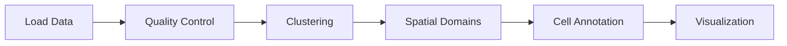
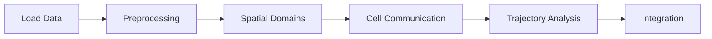

# Tutorials
{: .no_toc }

Learn spatial transcriptomics analysis through hands-on tutorials and examples.
{: .fs-6 .fw-300 }

## Table of contents
{: .no_toc .text-delta }

1. TOC
{:toc}

---

Welcome to the ChatSpatial tutorials! This section provides comprehensive guides for performing spatial transcriptomics analysis using natural language commands.

## Tutorial Categories

### 🚀 [Core Analysis](core/)
Essential spatial analysis techniques that every user should know:
- [Basic Spatial Analysis](core/basic_spatial_analysis.html) - Load data, quality control, clustering
- [Spatial Statistics](core/spatial_statistics.html) - Moran's I, spatial autocorrelation
- [Visualization Tutorial](core/visualization_tutorial.html) - Creating compelling spatial plots

### 🔬 [Analysis Methods](analysis/)
In-depth guides for specific analysis techniques:
- [Cell Type Annotation](analysis/cell_type_annotation.html) - Marker-based and reference-based annotation
- [Spatial Enrichment](analysis/spatial_enrichment.html) - Gene set enrichment in spatial context
- [Cell Communication Analysis](analysis/cell_communication_analysis.html) - LIANA, CellPhoneDB workflows

### 🎯 [Advanced Methods](advanced/)
Cutting-edge spatial analysis techniques:
- [Trajectory Analysis](advanced/trajectory_analysis.html) - RNA velocity and pseudotime
- [Spatial Registration](advanced/spatial_registration.html) - Multi-section alignment
- [Batch Integration](advanced/batch_integration.html) - Multi-sample integration

### 📚 [Learning Paths](learning-paths/)
Structured learning journeys for different skill levels:
- [Beginner Path](learning-paths/beginner.html) - Start here if you're new to spatial transcriptomics
- [Intermediate Path](learning-paths/intermediate.html) - Build on basic knowledge
- [Advanced Path](learning-paths/advanced.html) - Master cutting-edge techniques

## How to Use These Tutorials

### Prerequisites
Before starting any tutorial, ensure you have:
- ChatSpatial installed and configured
- Basic understanding of single-cell RNA-seq concepts
- Access to Claude Desktop or compatible MCP client

### Tutorial Format
Each tutorial follows a consistent format:
1. **Learning Objectives** - What you'll accomplish
2. **Prerequisites** - Required knowledge and setup
3. **Step-by-Step Instructions** - Detailed commands and explanations
4. **Expected Results** - What to expect from each step
5. **Troubleshooting** - Common issues and solutions
6. **Next Steps** - Where to go from here

### Interactive Examples
All tutorials use actual commands you can run in ChatSpatial:

```
# Example: Load and explore data
Load the mouse brain Visium dataset and show me basic statistics
```

```
# Example: Perform analysis
Identify spatial domains using SpaGCN and create visualization plots
```

## Getting Started

### New to Spatial Transcriptomics?
Start with the [Beginner Learning Path](learning-paths/beginner.html) which covers:
1. Basic concepts and terminology
2. Data loading and exploration
3. Quality control and preprocessing
4. Simple spatial analysis

### Have Single-Cell Experience?
Jump to [Core Analysis](core/) tutorials to learn spatial-specific techniques:
1. [Basic Spatial Analysis](core/basic_spatial_analysis.html)
2. [Spatial Statistics](core/spatial_statistics.html)
3. [Visualization Tutorial](core/visualization_tutorial.html)

### Ready for Advanced Methods?
Explore [Advanced Methods](advanced/) for cutting-edge techniques:
1. [Trajectory Analysis](advanced/trajectory_analysis.html)
2. [Spatial Registration](advanced/spatial_registration.html)

## Tutorial Data

### Demo Datasets
All tutorials use standardized demo datasets included with ChatSpatial:
- **Visium Mouse Brain** - Classic 10X Visium dataset
- **Slide-seq Cerebellum** - High-resolution spatial data
- **MERFISH Hypothalamus** - Single-cell resolution spatial data
- **SeqFish Embryo** - Developmental spatial data

### Loading Demo Data
```
# Load any demo dataset
Load the [dataset_name] demo data

# Examples:
Load the mouse brain Visium demo data
Load the cerebellum Slide-seq demo data
Load the hypothalamus MERFISH demo data
```

## Common Workflows

### Standard Spatial Analysis Pipeline


### Advanced Analysis Pipeline


## Tips for Success

### Best Practices
1. **Start Simple** - Begin with basic analysis before moving to advanced methods
2. **Understand Your Data** - Always explore data characteristics first
3. **Validate Results** - Cross-check findings with biological knowledge
4. **Document Parameters** - Keep track of analysis parameters for reproducibility

### Common Pitfalls
1. **Skipping Quality Control** - Always perform QC before analysis
2. **Over-interpreting Results** - Consider statistical significance and biological relevance
3. **Ignoring Spatial Context** - Remember that spatial information is key
4. **Using Wrong Parameters** - Understand method parameters and their effects

## Getting Help

### Within Tutorials
- Each tutorial includes troubleshooting sections
- Code examples are fully tested and verified
- Expected outputs are clearly described

### Additional Resources
- [API Reference](../reference/api/) - Detailed method documentation
- [Troubleshooting Guide](../reference/troubleshooting/) - Common issues and solutions
- [Community Discussions](https://github.com/cafferychen777/ChatSpatial/discussions) - Ask questions and share experiences

### Reporting Issues
Found an error in a tutorial? Please:
1. Check the [troubleshooting section](../reference/troubleshooting/)
2. Search [existing issues](https://github.com/cafferychen777/ChatSpatial/issues)
3. Create a [new issue](https://github.com/cafferychen777/ChatSpatial/issues/new) with details

---

Ready to start learning? Choose your path:

[Begin with Core Analysis](core/){: .btn .btn-primary .fs-5 .mb-4 .mb-md-0 .mr-2 }
[Explore Learning Paths](learning-paths/){: .btn .fs-5 .mb-4 .mb-md-0 }