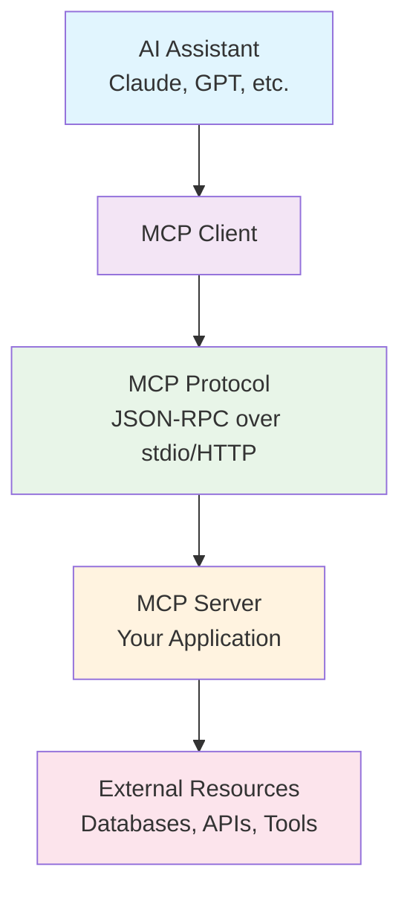

# What is Model Context Protocol (MCP)?

## Overview

**Model Context Protocol (MCP)** is an open standard developed by Anthropic that enables AI assistants to securely connect with external data sources and tools. It's like a universal "plugin system" that allows AI models to interact with real-world applications, databases, and services.

## The Problem MCP Solves

Before MCP, AI assistants were limited to their training data and couldn't:

- Access real-time information
- Interact with external tools and services
- Perform actions beyond text generation
- Connect to databases or APIs
- Use specialized software

Each integration required custom development, making it difficult to scale AI capabilities.

## How MCP Works

MCP creates a standardized bridge between AI assistants and external tools:



### Key Components

1. **MCP Client**: Built into AI assistants (like Claude Desktop)
2. **MCP Protocol**: Standardized communication layer
3. **MCP Server**: Your application that provides tools and data
4. **Resources**: External data sources, APIs, databases, files

## Core MCP Concepts

### Tools
Functions that AI assistants can call to perform actions:

```json
{
  "name": "analyze_spatial_data",
  "description": "Analyze spatial transcriptomics patterns",
  "inputSchema": {
    "type": "object",
    "properties": {
      "data_id": {"type": "string"},
      "method": {"type": "string", "enum": ["moran", "geary"]}
    }
  }
}
```

### Resources
Data sources that AI assistants can read:

```json
{
  "uri": "dataset://mouse_brain",
  "name": "Mouse Brain Visium Data",
  "mimeType": "application/x-anndata"
}
```

### Prompts
Reusable prompt templates with parameters:

```json
{
  "name": "analyze_spatial_domains",
  "description": "Template for spatial domain analysis",
  "arguments": [
    {"name": "tissue_type", "description": "Type of tissue"}
  ]
}
```

## Benefits of MCP

### For Users
- **Natural Language Interface**: Ask questions instead of writing code
- **Real-time Results**: Access live data and immediate analysis
- **No Setup Required**: Works out-of-the-box with compatible AI assistants
- **Secure Access**: Built-in permission controls

### For Developers
- **Standardized API**: One protocol works with all MCP-compatible AI assistants
- **Type Safety**: JSON Schema validation prevents errors
- **Easy Integration**: Simple protocol, extensive documentation
- **Future-proof**: Open standard with growing ecosystem

## MCP vs. Traditional Approaches

| Aspect | Traditional Tools | MCP-Enabled Tools |
|--------|------------------|-------------------|
| **Interface** | Command line, GUI | Natural language |
| **Learning Curve** | Steep, tool-specific | Minimal, conversational |
| **Integration** | Manual scripting | Automatic discovery |
| **Error Handling** | Manual debugging | AI-assisted troubleshooting |
| **Documentation** | Static manuals | Interactive help |
| **Workflow** | Linear, rigid | Flexible, adaptive |

## Real-World Example: Spatial Transcriptomics

### Traditional Workflow
```bash
# Load data
import scanpy as sc
adata = sc.read_h5ad("data.h5ad")

# Preprocess
sc.pp.normalize_total(adata)
sc.pp.log1p(adata)
sc.pp.highly_variable_genes(adata)

# Analyze
import squidpy as sq
sq.gr.spatial_neighbors(adata)
sq.gr.spatial_autocorr(adata)

# Visualize
sq.pl.spatial_scatter(adata, color="gene")
```

### MCP + ChatSpatial Workflow
```
👤 User: "Load my Visium data and identify spatial domains"

🤖 AI: I'll help you analyze your spatial transcriptomics data. Let me:
1. Load your Visium dataset
2. Perform preprocessing 
3. Identify spatial domains using SpaGCN
4. Create visualizations

[Automatically executes analysis and shows results]
```

## MCP Ecosystem

### Compatible AI Assistants
- **Claude Desktop**: Native MCP support
- **Custom Applications**: Using MCP SDK
- **Future Integrations**: GPT, Gemini, and others

### Popular MCP Servers
- **File Systems**: Access local and cloud files
- **Databases**: PostgreSQL, SQLite, MongoDB
- **APIs**: GitHub, Slack, Google Drive
- **Development Tools**: Git, Docker, Kubernetes
- **Scientific Tools**: **ChatSpatial** for spatial transcriptomics

## Getting Started with MCP

### 1. Install an MCP Client
Download Claude Desktop or build a custom client using the MCP SDK.

### 2. Configure MCP Servers
Add server configurations to your client:

```json
{
  "mcpServers": {
    "chatspatial": {
      "command": "python",
      "args": ["-m", "chatspatial"],
      "env": {}
    }
  }
}
```

### 3. Start Using Tools
Ask your AI assistant to use the available tools naturally.

## Security and Privacy

MCP includes built-in security features:

- **Permission Controls**: Granular access to tools and resources
- **Sandboxing**: Isolated execution environments
- **Audit Logging**: Track all tool usage and data access
- **Local Execution**: Keep sensitive data on your machine

## The Future of MCP

MCP represents a fundamental shift toward:

- **AI-Native Interfaces**: Tools designed for AI interaction
- **Composable Workflows**: Mix and match capabilities
- **Democratized Access**: Complex tools accessible to everyone
- **Collaborative AI**: Humans and AI working together seamlessly

## Learn More

- **Official Documentation**: [modelcontextprotocol.io](https://modelcontextprotocol.io)
- **GitHub Repository**: [MCP Specification](https://github.com/modelcontextprotocol)
- **ChatSpatial Example**: See how MCP enables spatial transcriptomics analysis

---

Ready to experience MCP in action? Try ChatSpatial with Claude Desktop and see how natural language can transform your spatial transcriptomics workflow!
